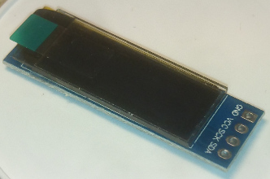
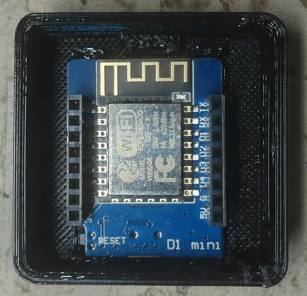

# Buildup of Lync-Display-Light

## Electronics
Solder the female pin header to the Wemos D1 mini board:

The WS2812b board has to be shortened at the lower part to fit into the housing. Then the pin
headers can be soldered.

To connect the display the black plastic of the connector has to be removed for the pins "5V", "GND", "D4" and "D3":

Then four short wires can be soldered from the WS2812b board to the SSD1306 OLED 128x32 I2C. I used
a ribbon cable for this purposes.

## Put into housing
The Wemos D1 mini board can be inserted into the bottom part of the housing with the USB
connector first and should then just snap in.

Remove the protective foil from the display. Then the display can be inserted into the groove
of the housing. Possibly the flat black cable foil on the right has to be folded to be able
to insert it.

Then the WS2812b board can be connected on top of the Wemos D1 mini.

Put the desired diffusor on top of the bottom part in an angle of 45°. Then just turn it to snap
in the diffusor to the bottom part. Connect the Lync display light to your PC and program it.
When it starts up, it sets the light to a dimm blue and the Welcome message is displayed.

## Author
[Marco Graf](https://github.com/grafmar)
