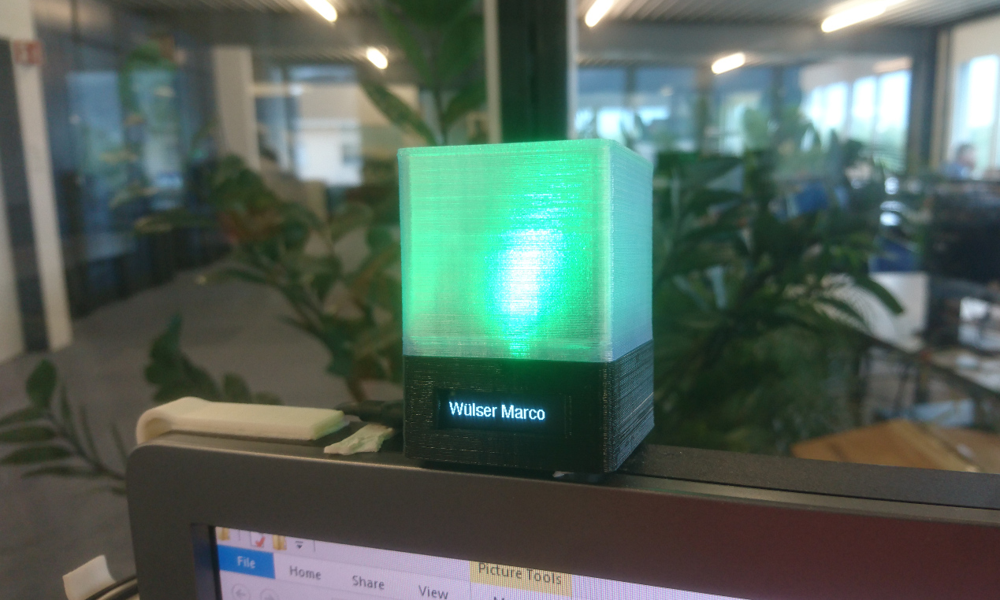
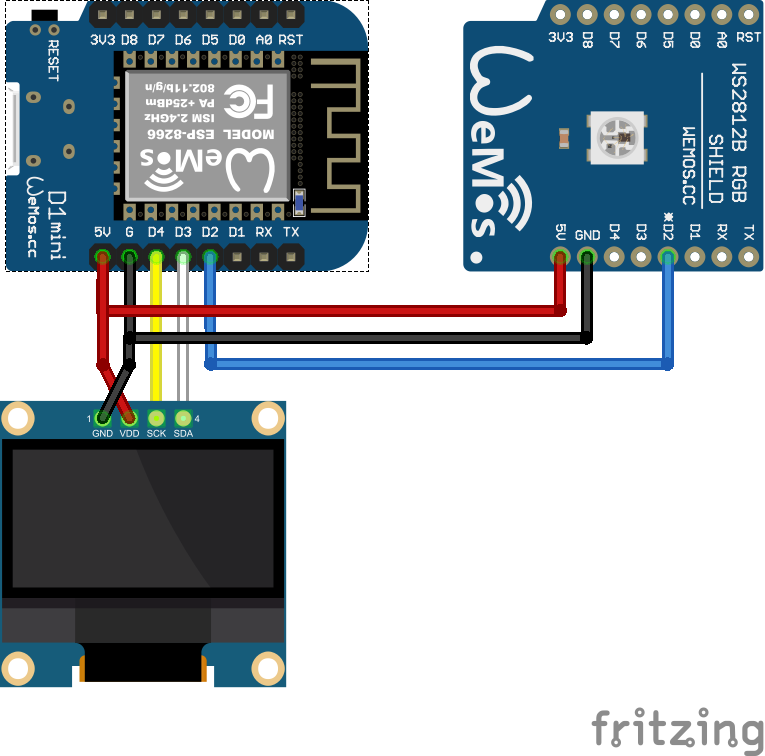
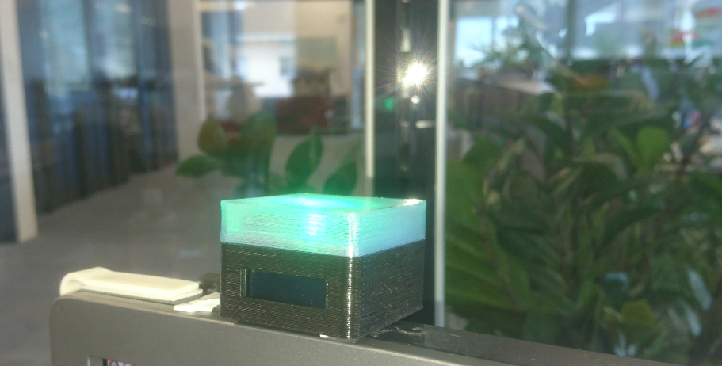
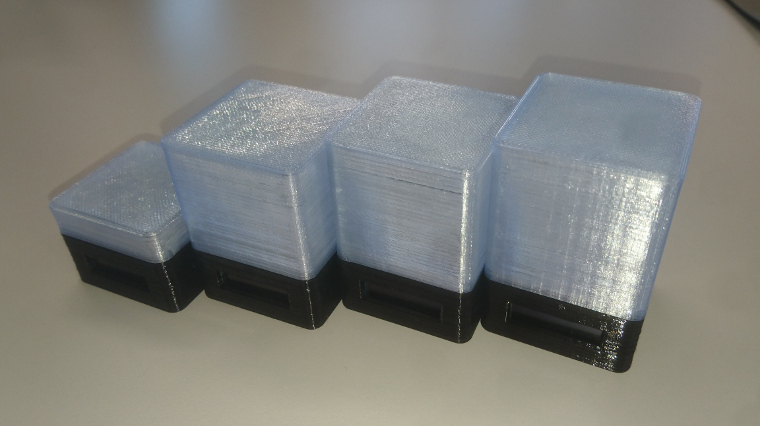
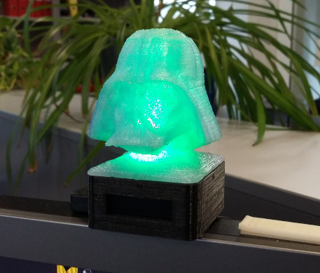
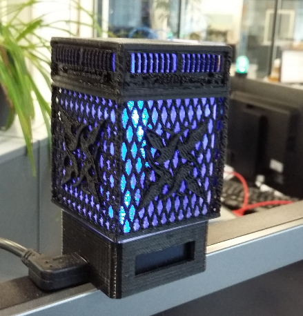

	# LyncDisplayLight
This device is just a simple RGB-LED with a display which can be controlled by the virtual serial port on its USB connection.
In combination with the appropriate desktop application [Lync-Presence-Bridge](https://github.com/grafmar/Lync-presence-bridge)
it shows the active Lync / Skype for Business state and in the case of a call or chat it displays the counterpart of the
conversation. This is especially useful, if the monitor is locked. That's why I implemented this device.

## SW-Protocol
To control the LyncDisplayLight the specific protocol string followed by a new-line character (ASCII 0x0A)
can be sent through the serial port at a speed of 115200 baud. The protocol string just a key-word
followed by a colon and then the parameters:

| Keyword | Parameters | Description |
| :--- | :--- | :--- |
| rgb     | red[0..255], green[0..255], blue[0..255] | Set the color of the cube light |
| callerid | string to display | Sets the Text on the Display. Send empty string to clear the display |

So to set the Color to yellow (red=255, green=255, blue=0) just set the string: `rgb:255,255,0\n`

To set a display text send the string: `callerid:John Doe\n`

## SW-Requirements
* [Arduino IDE](https://www.arduino.cc/en/main/software)
* [ESP8266 board support](https://github.com/arduino/Arduino/wiki/Unofficial-list-of-3rd-party-boards-support-urls): http://arduino.esp8266.com/stable/package_esp8266com_index.json
* Adafruit_NeoPixel library
* Adafruit_GFX library
* Adafruit_SSD1306 library
* [Visual Studio](https://visualstudio.microsoft.com/) to have a comfortable IDE
* [Visual Micro](https://www.visualmicro.com/) to integrate Arduino IDE in Visual Studio

## Hardware
The hardware consists of:
* Wemos D1 mini (available on [Aliexpress](https://www.aliexpress.com/item/D1-mini-Mini-NodeMcu-4M-bytes-Lua-WIFI-Internet-of-Things-development-board-based-ESP8266-by/32644199530.html))
* WS2812b board for Wemos D1 mini (available on [Aliexpress](https://www.aliexpress.com/item/WS2812B-RGB-expansion-board-for-D1-mini-BMP180/32806935855.html))
* 128x32 OLED display SSD1306 (soldered) (available on [Aliexpress](https://www.aliexpress.com/item/0-91-Inch-128x32-IIC-I2C-White-Blue-OLED-LCD-Display-DIY-Module-SSD1306-Driver-IC/32879702750.html))

### Wiring
The WS2812b board stacks just on top of the Wemos D1 mini. The connector of the LED has to be
unsoldered and then the OLED has to be soldered directly using wires. I wired it up to the
WS2812b board.

 

## Housing / Enclosure
The housing is 3D printed using black PLA for the base and clear PLA for the diffusor. I also
made different types with smaller diffusors or special diffusors. Even though the diffusor cube
is 42x42mm it doesn't look square if the height is also 42mm. Therefore I changed the hight to
38mm which looks sqare. This is the diffusor height I used most often.

 
  
 

## Buildup
A description how to build this device is available in the [documentation](Documentation/buildup.md).

## Author
[Marco Graf](https://github.com/grafmar)
